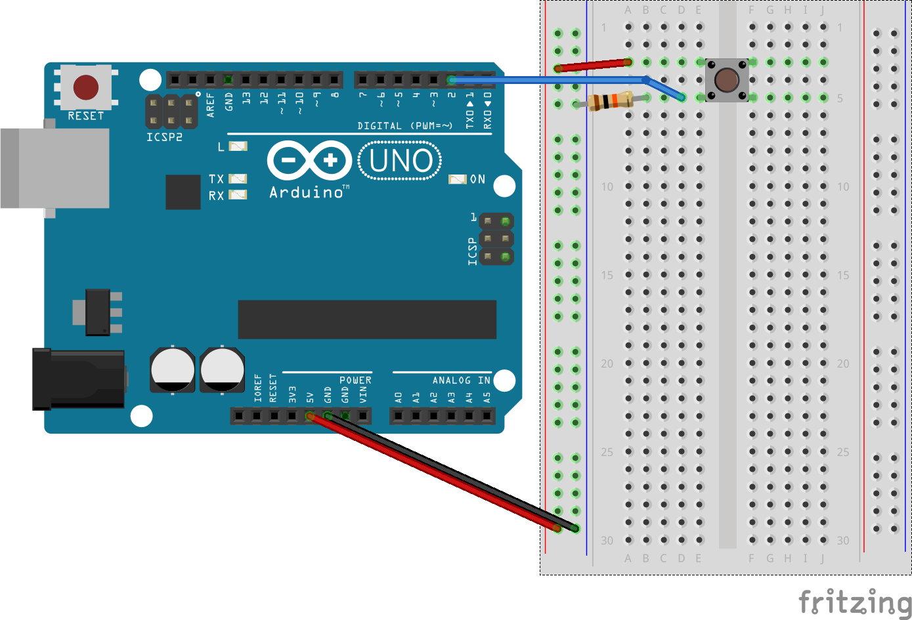

# About
EasyButton is a simple library that makes it easy to handle button input on a pin.

# Example
## Circuit

## Code
```cpp
#include <EasyButton.h>

EasyButton btn(2);

void setup() {
  Serial.begin(9600);
}

void loop() {
  if (btn.on(RISING_EDGE)) {
    Serial.println("Button is pressed!");
  }
}
```
